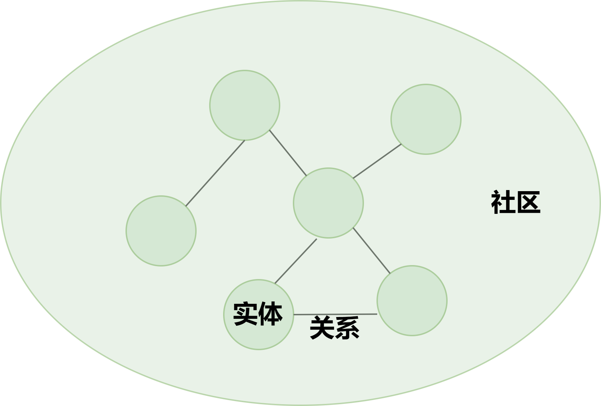
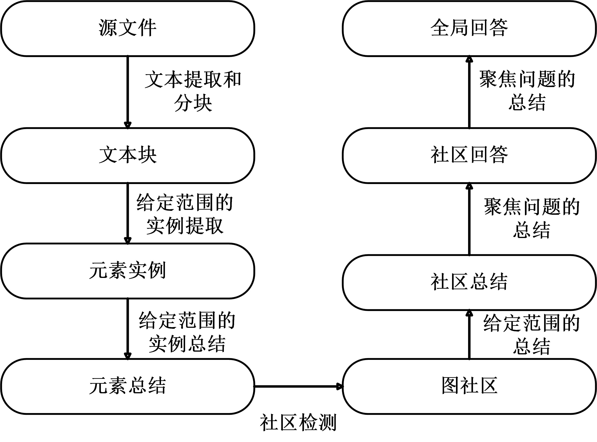
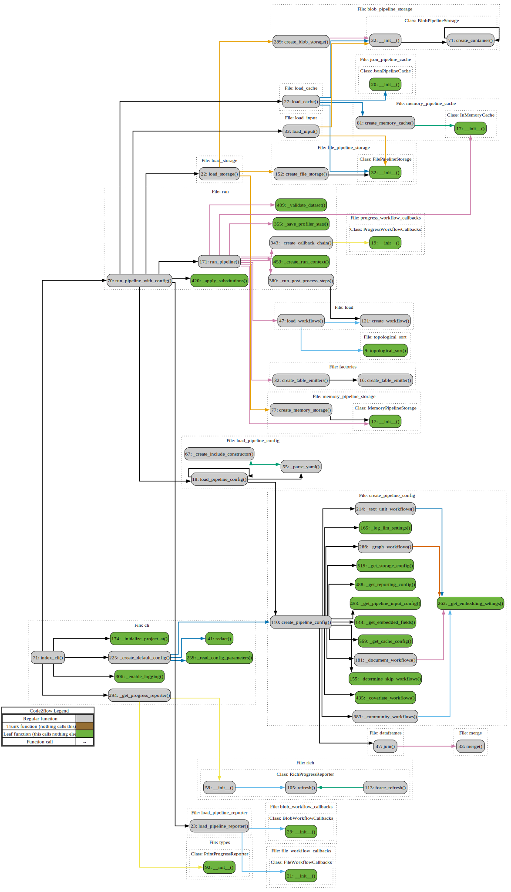
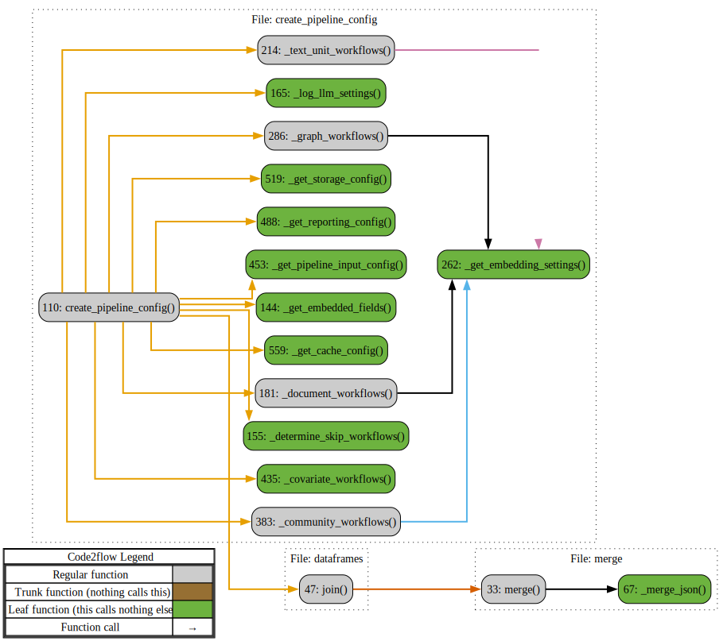
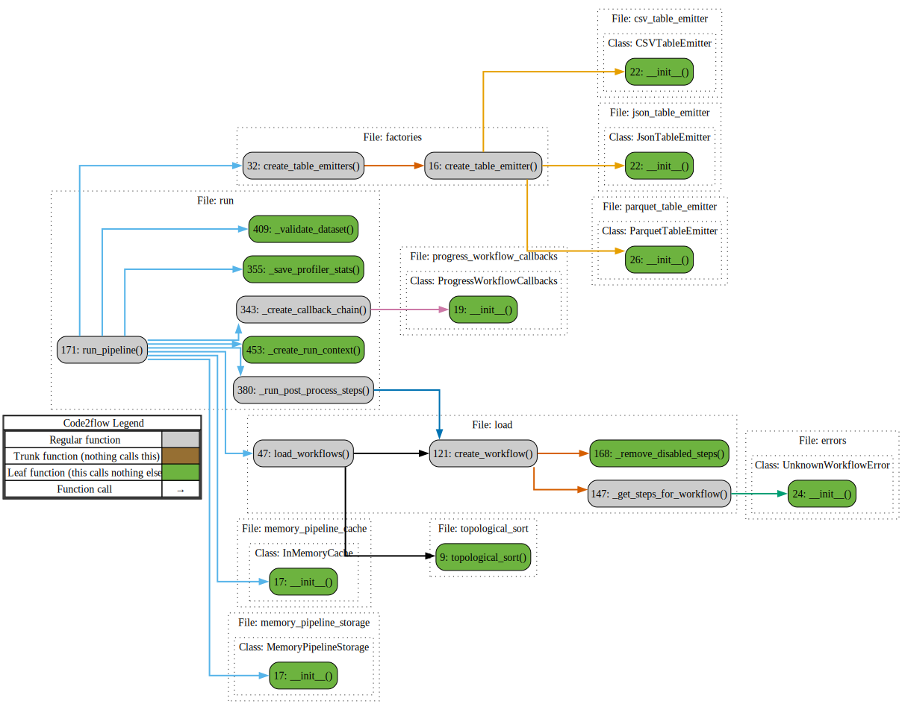
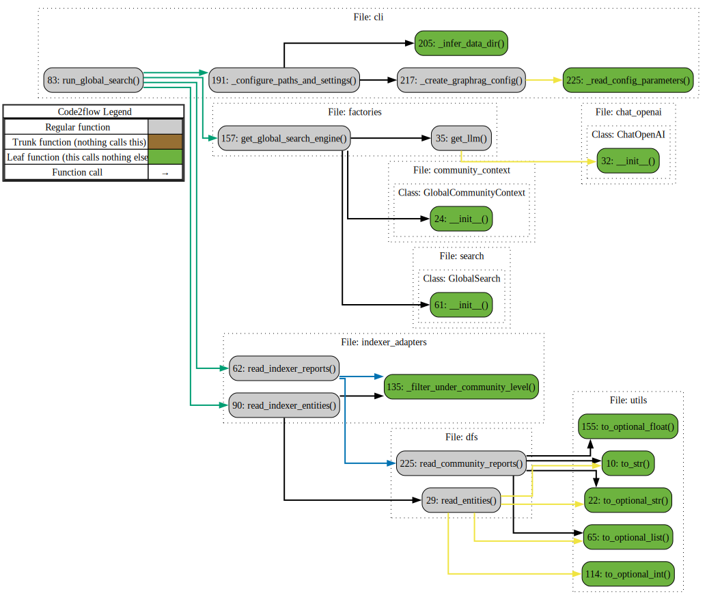
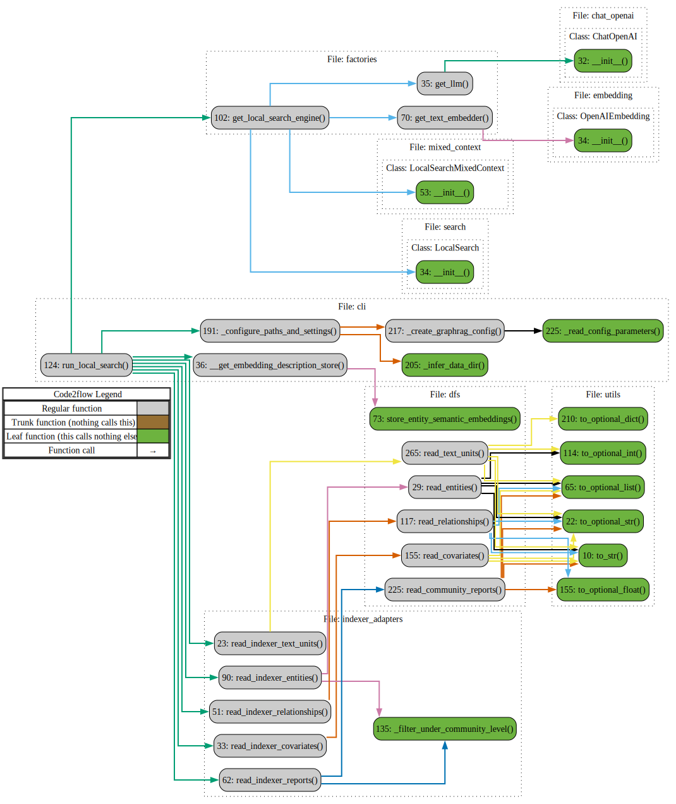

# 微软GraphRAG源码理解

## 1.引言

2024年四月份，微软发布一篇文章《From Local to Global: A Graph RAG Approach to Query-Focused Summarization》，提出了graphRAG的方法，该方法很好地解决了典型RAG系统在聚焦于查询的总结性 (QFS) 任务上存在的问题，并且在生成答案的全面性和多样性方面，Graph RAG 比朴素的 RAG 基线有了显着的改进。

2024年六月份，微软开源了graphRAG的项目 https://github.com/microsoft/graphrag 

为RAG带来新的发展，因此本人想从论文的原理以及源码部分去剖析和解读，希望进一步理解其核心结构，以求能做出一些速度上的优化

## 2.探究GraphRAG原理

- 为什么要在传统的RAG上发展GraphRAG？什么是GraphRAG？

传统RAG在针对整个文本语料库的全局问题上回答不佳，比如：这个数据集的主要主题是什么？这种问题不是简单的检索任务，是聚焦于全局查询的总结性任务。

GraphRAG核心思想：首先从源文档中派生一个实体知识图谱（通过大模型提取实体、关系，社区检测提取社区），然后为所有密切相关的实体组预先生成社区摘要。如果是全局搜索，汇总与用户问题有关的社区摘要最终生成一个全局性的答案；如果是局部搜索，会检索问题中的实体，找到实体相关的边和实体、实体所在的社区的摘要以及实体所在的文本块，汇总并排序和过滤，最终生成答案。



- graphRAG原理

  

graphRAG中的一些重要名词：

**文档（Documents)**：输入的文档。

**文本单元（Text Unit)**:要分析的文本块。这些块的大小、它们的重叠以及它们是否遵循任何数据边界可以自行配置。一个常见的用例是将`CHUNK_BY_COLUMNS`设置为`id` ，以便文档和 TextUnit 之间存在一对多关系，而不是多对多关系

**实体（Entity）**：从 TextUnit 中提取的实体。它们代表人物、地点、事件或您提供的其他一些实体模型

**关系（Relationship）**：两个实体之间的关系。这些是从协变量生成的。

**协变量(Covariate)** ：提取的声明信息，其中包含有关实体的陈述，这些陈述可能是时间相关的。

**社区报告（Community Report）**：生成实体后，对它们执行分层社区检测，并为该层次结构中的每个社区生成报告


- **流程**

（1）   将文本切割为文本块

（2）   LLM识别文本中的实体。大模型首先识别文本中的所有实体，包括它们的名称、类型和描述，然后再识别明确相关的实体之间的所有关系，包括源实体和目标实体及其关系的描述；进行了多轮实体收集

（3）   为实体创建摘要 LLM来独立地创建可能隐含但未由文本本身陈述的概念的有意义的摘要，

（4）   实体摘要->同质无向加权图 社区检测算法来将图划分为彼此之间的连接比与图中的其他节点之间的连接更强的节点社区

（5）   生成社区摘要 

（6）  社区摘要 → 社区答案 → 全局答案；

- 准备社区摘要，社区摘要被随机打乱并分成预先指定的token大小的块。这确保了相关信息分布在各个块中，而不是集中（并可能丢失）在单个上下文窗口中；
- 映射社区答案。并行生成中间答案，每个块一个。这LLM还要求生成 0-100 之间的分数，表明生成的答案对于回答目标问题有多大帮助。得分为 0 的答案将被过滤掉。
- reduce到全局答案。中间社区答案按有用性分数的降序排序，并迭代添加到新的上下文窗口中，直到达到令牌限制。最终上下文用于生成返回给用户的全局答案。

最终提供两种搜索的方法：本地搜索和全局搜索

**本地搜索：**本地搜索方法通过将人工智能提取的知识图谱中的相关数据与原始文档的文本块相结合来生成答案。此方法适用于需要了解文档中提到的特定实体的问题（例如洋甘菊的治疗特性是什么？）

**全局搜索：**全局搜索方法通过以map-reduce方式搜索所有大模型生成的社区报告来生成答案。这是一种资源密集型方法，但通常可以很好地回答需要理解整个数据集的问题（例如，本笔记本中提到的草药最重要的价值是什么？）

## 3.源码结构

源码的结构如下

```
├─config
│  ├─input_models
│  └─models
├─index
│  ├─cache
│  ├─config
│  ├─emit
│  ├─graph
│  │  ├─embedding
│  │  ├─extractors
│  │  │  ├─claims
│  │  │  ├─community_reports
│  │  │  ├─graph
│  │  │  └─summarize
│  │  ├─utils
│  │  └─visualization
│  ├─input
│  ├─llm
│  ├─progress
│  ├─reporting
│  ├─storage
│  ├─text_splitting
│  ├─utils
│  ├─verbs
│  │  ├─covariates
│  │  │  └─extract_covariates
│  │  │      └─strategies
│  │  │          └─graph_intelligence
│  │  ├─entities
│  │  │  ├─extraction
│  │  │  │  └─strategies
│  │  │  │      └─graph_intelligence
│  │  │  └─summarize
│  │  │      └─strategies
│  │  │          └─graph_intelligence
│  │  ├─graph
│  │  │  ├─clustering
│  │  │  │  └─strategies
│  │  │  ├─embed
│  │  │  │  └─strategies
│  │  │  ├─layout
│  │  │  │  └─methods
│  │  │  ├─merge
│  │  │  └─report
│  │  │      └─strategies
│  │  │          └─graph_intelligence
│  │  ├─overrides
│  │  └─text
│  │      ├─chunk
│  │      │  └─strategies
│  │      ├─embed
│  │      │  └─strategies
│  │      ├─replace
│  │      └─translate
│  │          └─strategies
│  └─workflows
│      └─v1
├─llm
│  ├─base
│  ├─limiting
│  ├─mock
│  ├─openai
│  └─types
├─model
├─prompt_tune
│  ├─generator
│  ├─loader
│  ├─prompt
│  └─template
├─query
│  ├─context_builder
│  ├─input
│  │  ├─loaders
│  │  └─retrieval
│  ├─llm
│  │  └─oai
│  ├─question_gen
│  └─structured_search
│      ├─global_search
│      └─local_search
└─vector_stores

```

### 3.1索引 Index

graphRAG第一步：构建索引，下面是执行语句

```
python -m graphrag.index --init --root ./ragtest
python -m graphrag.index --root ./ragtest
```

对应的源码在graphrag/index/\_\_main\_\_.py，其中\_\_main\_\_.py通过用户给定的参数去调用cli.py中的index_cli函数;

我们使用code2flow库生成index_cli的调用链的流程图，如下图所示



#### **（1）**初始化

该函数的_initialize_project_at函数首先检查settings.yaml、.env、prompts等文件是否存在，没有就创建，其中settings.yaml主要是记录llm的api_key、embedding的api_key,并行化的配置、异步模型的配置、文本分块、本地搜索、全局搜索配置等一些信息；env中就是graph_rag的api_key，prompts中主要是实体的提取、实体描述的总结、提取实体的声明、社区报告的生成的提示词，下面是对英文提示词的一个概括：

```
实体提取的提示词内容概括：
描述了一个任务，目的是从给定的文本文档中识别并提取指定实体类型的所有实体，以及这些实体之间的关系。具体步骤如下：

1. **识别实体**：从文本中识别出所有符合指定类型的实体。对于每个识别出的实体，提取以下信息：
   - **实体名称**：实体的名称（首字母大写）
   - **实体类型**：实体所属的类型（从给定的实体类型列表中选择）
   - **实体描述**：对实体的属性和活动的全面描述

   每个实体将以特定格式表示。

2. **识别关系**：从步骤1中识别出的实体中，找出所有明确相关的实体对（source_entity和target_entity）。对于每对相关实体，提取以下信息：
   - **源实体**：来源实体的名称
   - **目标实体**：目标实体的名称
   - **关系描述**：解释为何认为这两个实体之间存在关系
   - **关系强度**：一个数字评分，用于表示源实体和目标实体之间关系的强度

   每个关系也将以特定格式表示。

3. **生成输出**：最终的输出将是一个包含所有识别出的实体和关系的列表，格式化为指定的分隔符形式。

该任务的目的是从文本中结构化地提取出实体及其关系，以便进一步分析或使用。
```

```
实体描述总结的提示词内容概括：
下面描述了你的任务：你需要生成一个关于所提供数据的综合总结。具体步骤如下：

1. 给定一个或两个实体，以及与这些实体相关的一系列描述。
2. 将所有这些描述连接起来，形成一个完整的综合描述。
3. 确保包含所有描述中的信息，并解决其中可能存在的矛盾，提供一个连贯的总结。
4. 确保使用第三人称来撰写，并且要包括实体名称，以便提供完整的上下文。

最终输出将是一个完整的、无矛盾的描述，涵盖所有提供的描述信息。
```

```
提取声明的提示词内容概括：
这段话描述了一项任务，目标是帮助从文本文档中分析针对特定实体的声明。任务的具体步骤如下：

1. **提取实体**：从文本中提取与预定义的实体规范匹配的所有命名实体。实体规范可以是实体名称列表或实体类型列表。
  
2. **提取声明**：对于每个识别出的实体，提取与该实体相关的所有声明。这些声明需要与指定的声明描述相匹配，并且实体应为声明的主题。每个声明需要提取以下信息：
   - **主题实体**：作为声明主题的实体名称，需大写，且必须是步骤1中识别出的实体。
   - **对象实体**：声明中涉及的对象实体名称，需大写。如果对象实体未知，使用 **NONE**。
   - **声明类型**：声明的整体类别，需大写，并能在多个文本输入中重复使用，以便类似的声明共享相同的声明类型。
   - **声明状态**：标记为 **TRUE**（确认）、**FALSE**（虚假）或 **SUSPECTED**（怀疑）。TRUE 表示声明已确认，FALSE 表示声明被证伪，SUSPECTED 表示声明尚未验证。
   - **声明描述**：详细说明声明的依据，以及所有相关的证据和参考资料。
   - **声明日期**：声明提出的期间（开始日期和结束日期），需使用 ISO-8601 格式。如果声明只在某一天提出，则开始日期和结束日期相同。如果日期未知，返回 **NONE**。
   - **声明来源文本**：原始文本中与声明相关的所有引述的列表。

   每个声明按照特定的格式表示。

3. **生成输出**：最终输出将是所有识别出的声明的列表，格式化为指定的分隔符形式。

任务的总体目标是从文本中结构化地提取出与指定实体相关的声明及其详细信息，以便进一步分析和使用。
```

```
社区报告的提示词的内容概括：
这段话描述了一项任务，你作为一个AI助手，帮助人类进行信息发现。信息发现是指在一个网络中识别和评估与某些实体（例如组织和个人）相关的相关信息。

### 目标
编写一个关于某个社区的综合报告，该社区包含一组实体及其关系，以及可能相关的声明。报告将用于向决策者传达与该社区相关的信息及其潜在影响。报告的内容包括社区主要实体的概述、法律合规性、技术能力、声誉以及值得注意的声明。

### 报告结构

报告应包括以下部分：

- **标题**：代表社区关键实体的社区名称，标题应简短且具体。如果可能，应在标题中包含代表性的命名实体。
- **摘要**：社区整体结构的执行摘要，描述实体之间的关系以及与这些实体相关的重要信息。
- **影响严重性评分**：一个介于0到10之间的浮动分数，表示社区内实体可能带来的影响严重性。影响评分代表社区的重要性。
- **评分解释**：用一句话解释影响严重性评分。
- **详细发现**：列出关于社区的5到10个关键见解。每个见解应包括一个简短摘要，后跟多个段落的解释性文本，依据特定的规则进行支持。要求内容全面。

报告最终以JSON格式返回，包含标题、摘要、评分、评分解释和详细发现部分。

### 参考规则
支持数据的论点应列出数据引用。引用中最多列出5个记录ID，多于5个时使用“+more”表示有更多相关数据。

报告应基于提供的输入文本，不能编造信息。

这项任务的目的是为决策者提供一个全面的、基于数据的社区报告，以帮助他们理解社区内实体的动态及其潜在影响。
```

#### （2）创建pipeline

然后_create\_default\_config函数创建pipelineConfig，创建管道，以及其中的workflow工作流

具体步骤为首先检查配置文件，在\_read\_config\_parameters函数内部读取配置文件，主要就是加载yaml中定义的一些配置

然后根据当前配置参数，创建一个pipeline，在函数create_pipeline_config中，这个函数首先确定要跳过的工作流（workflows），获取嵌入字段，然后根据设置构建输入、报告、存储和缓存配置，下面是创建管道的核心代码

```python
result = PipelineConfig(
        root_dir=settings.root_dir,
        input=_get_pipeline_input_config(settings),
        reporting=_get_reporting_config(settings),
        storage=_get_storage_config(settings),
        cache=_get_cache_config(settings),
        workflows=[
            *_document_workflows(settings, embedded_fields),
            *_text_unit_workflows(settings, covariates_enabled, embedded_fields),
            *_graph_workflows(settings, embedded_fields),
            *_community_workflows(settings, covariates_enabled, embedded_fields),
            *(_covariate_workflows(settings) if covariates_enabled else []),
        ],
    )
```

这里涉及到微软的dataShaper库，DataShaper 提供了一组常用的数据转换操作，这些操作可以被链式调用，以形成复杂的数据处理流程。这些操作包括基本的数据表操作，如过滤、排序、分组等。

这些verb定义操作的具体实现在index/verbs中，有一些基础的verb是datashaper库自带的



#### （3）执行pipeline

1.加载配置和依赖项。load_pipeline_config和_apply_substitutions

2.设置存储、缓存、回调和进度报告器。\_create_storage、\_create_cache、\_create_reporte、_create_postprocess_steps

3.加载和验证数据集。

4.运行工作流，处理数据，并收集统计信息。

```
    async for table in run_pipeline(
        workflows=workflows,
        dataset=dataset,
        storage=storage,
        cache=cache,
        callbacks=callbacks,
        input_post_process_steps=post_process_steps,
        memory_profile=memory_profile,
        additional_verbs=additional_verbs,
        additional_workflows=additional_workflows,
        progress_reporter=progress_reporter,
        emit=emit,
        is_resume_run=is_resume_run,
    ):
```

5.存储结果和统计信息，处理异常



### 3.2 workFlow工作流的实现

### （1）测试

我们执行命令初始化一个rag的文件夹

```
python -m graphrag.index --init --root ./ragFile_test
```

新建input文件夹然后在input文件夹，修改yaml中的api_key和model

在input文件夹下放入一个txt文档并执行

```
python -m graphrag.index --root ./ragFile_test
```

我们来查看终端的打印的workflow

```
 GraphRAG Indexer
├── Loading Input (text) - 1 files loaded (0 filtered) ━━━━━━━━━━━━━━━━━━━━━━━━━━━━━━━━━━━━━━━━ 100% 0:00:00 0:00:00
├── create_base_text_units
├── create_base_extracted_entities
├── create_summarized_entities
├── create_base_entity_graph
├── create_final_entities
├── create_final_nodes
├── create_final_communities
├── join_text_units_to_entity_ids
├── create_final_relationships
├── join_text_units_to_relationship_ids
├── create_final_community_reports
├── create_final_text_units
├── create_base_documents
└── create_final_documents
🚀 All workflows completed successfully.
```

### （2）Loading Input

对应代码在graphrag/index/input/load_input.py

代码主要步骤为：

1. **文件类型判断**：
   - 代码中通过 `config.file_type` 来判断文件类型，并根据文件类型从 `loaders` 字典中选择对应的加载器。
   - 对于 `txt` 文件，如果 `file_type` 被设置为 `text`，那么代码将选择 `load_text` 作为加载器。
   - 对于csv文件，代码将选择 load_csv作为加载器
2. **加载流程**：
   - 假设输入为txt，代码将使用 `load_text` 方法来加载 `txt` 文件的内容，并将内容转换为一个 `pandas.DataFrame`。
   - 加载过程中，如果提供了 `ProgressReporter`，加载进度将通过 `progress_reporter.child` 创建的 `progress` 对象进行报告。
3. **异常处理**：
   - 如果 `config.file_type` 不属于 `loaders` 字典的键（即未知的文件类型），代码将抛出一个 `ValueError`，提示未知的输入类型。


### （3）create_base_text_units

代码在graphrag/index/workflows/v1目录下

里面涉及到很多datashaper库的verb以及自己定义的verb

具体步骤为：

排序、打包、聚合、文本切块、选择列、展开、重命名、生成ID、解压、复制、过滤空文本

主要关注一下文本切块，代码中使用’chunk‘这个verb，这个verb的函数定义在代码graphrag/index/verbs/text/chunk/text_chunk.py

chunk中有两种chunk策略可供选择：tokens和sentence，默认是tokens，默认的chunk_size是1200，chunk_overlap是100，tokens策略下的对应函数split_text_on_tokens，这个函数就是将文本按照chunk_size定义的每个文本块的最大token，将文本切割成多个较小的块，每个块中间保留部分冗余

sentence策略则是直接调用nltk库，将文本划分为一个个句子

### （4）create_base_extracted_entities

代码在graphrag/index/workflows/v1目录下，包含了四个verb：entity_extract、snapshot、merge_graphs、snapshot_rows

这些verbs的具体实现也可以在graphrag/index/verbs中找到

这里entity_extract提取实体也有两种策略，一种是graph_intelligence，另一种是nltk。

**graph_intelligence**：通过大模型和前面所说的提取实体的提示词，来最终从文本中提取实体

**nltk**：通过nltk的`ne_chunk` 进行命名实体识别，首先对文本进行分词（`word_tokenize`）和词性标注（`pos_tag`），然后识别命名实体，对于识别出的每个实体 `chunk`，如果它具有 `label`（即是一个命名实体），则获取其类型 `entity_type` 并检查是否在 `entity_types` 列表中，如果在同一文档中发现了多个实体，函数会将它们两两相连，在图中添加边（`edge`），并为每条边附加描述和源文档ID


**snapshot**是将提取到的实体保存成parquet格式或者json格式

**merge_graphs**将多个图（graph）合并为一个图。这个函数通过使用节点和边的操作，将不同的图合并，最终生成一个图，将合并后的图导出为 GraphML 格式并存储在输出数据框的指定列中

**snapshot_rows**对数据表中的每一行进行快照，并将快照结果存储在指定的位置

### （5）create_summarized_entities

包含两个verb：summarize_descriptions和snapshot_rows

**summarize_descriptions**只有一个策略：graph_intelligence，这个策略就是通过大模型和之前提到的实体总结的提示词，生成对每个实体和边的描述总结，总结后的结果以 GraphML 格式存储

**snapshot_rows**对数据表中的每一行进行快照，并将快照结果存储在指定的位置

### （6）create_base_entity_graph

包含五个verb：cluster_graph、snapshot_rows、embed_graph、snapshot_rows、select

**cluster_graph**：使用Leiden 算法将图形中的节点分配到不同的社区（clusters）中，并生成相应的聚类图

**主要步骤**：

- **图形聚类**：调用 `run_layout` 函数（主要是leiden算法）对图进行聚类。结果存储在 `community_map_to` 列中。
- **计算聚类层次**：提取聚类的层次信息并存储到 `level_to` 列中。
- **应用聚类**：对每一行数据，根据不同的层次应用聚类，并将结果存储到 `to` 列中。
- **数据表操作**：最终，将聚类层次和图形数据分解为独立的列，并返回处理后的数据表

**embed_graph**：将图（graph）嵌入到一个向量空间中。主要通过指定的策略（如 `node2vec`）来生成图中节点的向量表示

`node2vec` 是一种用于图嵌入的技术，通过模拟随机游走（random walks），将图中的节点转换为固定维度的向量

### （7）create_final_entities

将base_entity_graph中的节点信息提取、清洗、嵌入，并生成一个包含实体名称及其描述嵌入向量的最终实体表

包含的verb如下：

**`unpack_graph`**：从graphml格式的图中提取节点（实体）和边。

**`rename`**：将节点的 `label` 列重命名为 `title`，然后进一步将 `title` 重命名为 `name`。

**`select`**：选择感兴趣的列，如 `id`、`name`、`type` 等。

**`dedupe`**：对实体进行去重，确保每个实体只有一个唯一的 `id`。

**`filter`**：过滤掉名称为空的实体。

**`text_split`**：将 `source_id` 列按逗号分隔，并将结果存入 `text_unit_ids` 列。

**`drop`**：删除不再需要的 `source_id` 列。

**`text_embed`**（两次）：执行文本嵌入操作，分别对实体名称和名称+描述进行嵌入，生成向量表示。

**`merge`**：将 `name` 和 `description` 列合并为一个新列 `name_description`，用于后续的嵌入。

**`filter`**：在不使用向量存储的情况下，过滤掉嵌入为空的描述

### （8）create_final_nodes

主要步骤如下：

**配置获取**：

- **`snapshot_top_level_nodes`**：从配置中获取是否对顶层节点进行快照（保存节点信息），默认为 `False`。
- **`layout_graph_enabled`**：检查是否启用图布局（默认为 `True`），如果未启用，布局策略将使用 "zero"（表示不进行布局）。
- **`_compute_top_level_node_positions`**：定义了一组步骤，用于计算和处理顶层节点的位置。包括从图中解包节点、过滤指定层次的节点、选择坐标信息、对顶层节点进行快照、重命名和转换节点 ID 等操作。

**布局图**：

- **`layout_graph`**：帮助用户对图形数据进行布局和可视化操作。支持的布局策略包括 UMAP 和 Zero，可以根据需要选择不同的算法进行节点位置的计算，并将结果应用到图形中，用于进一步的分析或可视化展示。

**节点信息解包和处理**：

- **`unpack_graph`**：从 `positioned_graph` 列中解包节点信息，提取每个节点的属性。
- **`drop`**：去掉没有位置（`x` 和 `y` 坐标）的节点列。

**顶层节点的位置计算和处理**：

- 包含多个步骤，如过滤指定层次的节点、快照保存、重命名 ID、以及将 ID 转换为字符串格式。这些操作旨在处理顶层节点并确保它们的位置信息正确无误。

**节点连接**：

- **`join`**：将之前处理的顶层节点与原始的无位置节点表进行关联，基于 `id` 和 `top_level_node_id` 进行连接，整合顶层节点的位置数据。

**节点信息重命名**：

- **`rename`**：将节点的 `label` 列重命名为 `title`，将 `cluster` 列重命名为 `community`，以便更好地描述节点信息。

### （9）create_final_communities

从基础实体图中提取信息并构建社区关系表，最后输出一个包含社区信息的表格

主要步骤如下：

**基础实体图解包 (`unpack_graph`)**：

- 代码从 `workflow:create_base_entity_graph` 中提取基础实体图，并将图中的节点和边分别解包成独立的数据集，分别命名为 `graph_nodes` 和 `graph_edges`。

**节点和边的关联 (`join`)**：

- 接着，代码分别将 `graph_nodes` 与 `graph_edges` 按照 `label` 字段进行连接，生成 `source_clusters` 和 `target_clusters`。这些步骤的目的是将节点与其关联的边连接起来。

**合并与过滤 (`concat` 和 `filter`)**：

- 将 `source_clusters` 和 `target_clusters` 合并为 `concatenated_clusters`，然后通过过滤步骤保留那些连接在一起且级别相同的节点对，结果存储在 `combined_clusters` 中。

**聚合社区关系 (`aggregate_override`)**：

- 对合并后的节点和边进行聚合，创建 `cluster_relationships`，其目的是为每个社区（cluster）生成关系 ID 列表和文本单元 ID 列表。

**所有社区的聚合 (`aggregate_override`)**：

- 再次聚合，生成 `all_clusters`，以便提取每个社区的唯一 ID 和层级信息。

**社区信息关联 (`join`)**：

- 将 `all_clusters` 与 `cluster_relationships` 连接，生成一个包含社区关系和层级信息的表。

**社区标题创建**：

- 在这一步中，代码通过 `create_community_title_wf` 定义的步骤为每个社区生成一个标题（`title`），格式为 `"Community " + id`。

**选择最终列 (`select`)**：

- 最后，代码选择关键列（如 `id`、`title`、`level`、`relationship_ids`、`text_unit_ids`）来构建最终的社区表

### （10）join_text_units_to_entity_ids

生成一个从文本单元 ID 到实体 ID 的关联表格，这可以用于在文本数据和实体数据之间建立映射关系

具体步骤：

**选择列 (`select`)**：

- 从 `workflow:create_final_entities` 中选择 `id` 和 `text_unit_ids` 列。这一步的目的是从实体表中提取出实体的 ID 以及与之关联的文本单元 ID。

**展开文本单元 ID (`unroll`)**：

- 将 `text_unit_ids` 列展开，即将原本可能是列表形式的文本单元 ID 分成多行，每个文本单元 ID 对应一行。这使得每个文本单元 ID 都有一个独立的行，与其对应的实体 ID 保持关联。

**聚合和重命名 (`aggregate_override`)**：

- 通过对 `text_unit_ids` 进行分组，聚合对应的实体 ID 列表，并将结果存储在 `entity_ids` 列中。
- 另外，对 `text_unit_ids` 列应用 `any` 操作，以确保它们在聚合后的表中仍然可用，并将其存储在 `id` 列中

### （11）create_final_relationships

生成一个包含最终关系信息的表格，其中包括文本嵌入、边信息的组合度数计算以及与文本单元的关联信息

具体步骤：

**配置获取**：

- **`base_text_embed`**：从配置中获取基础的文本嵌入配置，用于在后续的文本嵌入步骤中使用。
- **`relationship_description_embed_config`**：获取关系描述的嵌入配置，如果没有单独配置，使用基础的文本嵌入配置。
- **`skip_description_embedding`**：检查是否需要跳过描述的嵌入操作。

**图形关系边的解包 (`unpack_graph`)**：

- 从 `workflow:create_base_entity_graph` 中提取图形关系边，将图形的边信息解包并存储在 `clustered_graph` 列中。

**重命名列 (`rename`)**：

- 将 `source_id` 列重命名为 `text_unit_ids`，以便后续处理。

**过滤层级 (`filter`)**：

- 通过过滤操作，仅保留层级为 `0` 的边信息。

**描述文本嵌入 (`text_embed`)**：

- 如果未跳过描述嵌入操作，将 `description` 列中的文本进行嵌入，生成 `description_embedding`。

**删除层级列 (`drop`)**：

- 删除不再需要的 `level` 列，将结果存储在 `pruned_edges` 中。

**过滤节点 (`filter`)**：

- 从 `workflow:create_final_nodes` 中提取并过滤节点信息，保留层级为 `0` 的节点，结果存储在 `filtered_nodes` 中。

**计算边的组合度数 (`compute_edge_combined_degree`)**：

- 计算边的组合度数，并将结果存储在 `rank` 列中。

**转换列类型 (`convert`)**：

- 将 `human_readable_id` 转换为字符串类型，并将 `text_unit_ids` 转换为数组类型，以便于后续处理和分析。

### （12）join_text_units_to_relationship_ids

生成一个从文本单元 ID 到关系 ID 的关联表格，使得每个文本单元 ID 都能映射到与之关联的关系 ID 列表

具体步骤：

**选择列 (`select`)**：

- 从 `workflow:create_final_relationships` 生成的关系表中选择 `id` 和 `text_unit_ids` 列。这一步是从最终生成的关系表中提取所需的列，`id` 表示关系 ID，`text_unit_ids` 表示与该关系关联的文本单元 ID 列表。

**展开文本单元 ID (`unroll`)**：

- 将 `text_unit_ids` 列展开，即将每个关系 ID 关联的文本单元 ID 列表展开为多个单独的行。这样每个文本单元 ID 都有自己的一行，并且仍然与其对应的关系 ID 保持关联。

**聚合和重命名 (`aggregate_override`)**：

- 对 `text_unit_ids` 进行分组，聚合与其关联的 `id`（关系 ID）并将结果存储在 `relationship_ids` 列中。这一步将所有与某个文本单元 ID 关联的关系 ID 汇总在一起。
- 同时，将 `text_unit_ids` 列通过 `any` 操作保留下来，并将其重命名为 `id`。

**选择最终列 (`select`)**：

- 选择最终输出的列，生成 `text_unit_id_to_relationship_ids` 表格，该表格包含 `id`（即 `text_unit_ids`）和 `relationship_ids` 列，用于描述每个文本单元 ID 关联的关系 ID 列表。

### （13）create_final_community_reports

生成一个包含社区报告的表格，报告包括嵌入的文本内容，并结合社区的节点、边和层级信息

**配置获取**：

- **`covariates_enabled`**：从配置中获取是否启用协变量处理，如果启用，将在社区报告中包含协变量信息。
- **嵌入配置**：包括 `community_report_full_content_embed_config`、`community_report_summary_embed_config` 和 `community_report_title_embed_config`，这些配置用于控制文本嵌入的具体实现。
- **跳过嵌入标志**：根据配置确定是否跳过标题、摘要和完整内容的嵌入处理。

**节点、边和声明表的准备**：

- **`prepare_community_reports_nodes`** 和 **`prepare_community_reports_edges`**：分别准备用于社区报告的节点和边信息。
- **`prepare_community_reports_claims`**：如果启用了协变量处理，还会准备主张表。

**恢复社区层级 (`restore_community_hierarchy`)**：

- 从节点信息中恢复社区层级结构，以便在后续的报告生成过程中使用。

**生成社区报告 (`prepare_community_reports`)**：

- 结合节点、边和层级信息，生成社区的上下文信息，准备社区报告的内容。

**创建社区报告 (`create_community_reports`)**：

- 使用社区报告配置，创建最终的社区报告。

**生成唯一ID (`window`)**：

- 为每个社区报告生成一个唯一的ID，与社区ID区分开。

**文本嵌入 (`text_embed`)**：

- 为社区报告的完整内容、摘要和标题分别生成嵌入向量，便于后续的分析或搜索

### （14）create_final_text_units

生成一个包含最终文本单元的表格，该表格包含文本内容及其嵌入表示、相关的实体和关系信息，以及可选的协变量信息

**配置获取**：

- **`base_text_embed`**：从配置中获取基础的文本嵌入配置，用于后续文本嵌入步骤。
- **`text_unit_text_embed_config`**：获取特定的文本单元嵌入配置，如果没有单独配置，使用基础的文本嵌入配置。
- **`covariates_enabled`**：检查是否启用了协变量处理，这决定是否将协变量信息加入到最终的文本单元表中。
- **`skip_text_unit_embedding`**：检查是否跳过文本单元的嵌入处理。
- **`is_using_vector_store`**：检查是否使用了向量存储，影响最终输出的列。

**选择基础列 (`select`)**：

- 从 `workflow:create_base_text_units` 中选择 `id`, `chunk`, `document_ids` 和 `n_tokens` 列。这些列是构建文本单元的基础信息。

**重命名列 (`rename`)**：

- 将 `chunk` 列重命名为 `text`，以便后续处理和分析。

**扩展文本单元与实体 ID 的关联 (`join`)**：

- 使用 `join` 操作，将 `workflow:join_text_units_to_entity_ids` 生成的实体 ID 与文本单元关联。

**扩展文本单元与关系 ID 的关联 (`join`)**：

- 使用 `join` 操作，将 `workflow:join_text_units_to_relationship_ids` 生成的关系 ID 与文本单元关联。

**扩展文本单元与协变量 ID 的关联 (`join`)**：

- 如果启用了协变量处理，使用 `join` 操作，将 `workflow:join_text_units_to_covariate_ids` 生成的协变量 ID 与文本单元关联。

**聚合文本单元的实体和关系信息 (`aggregate_override`)**：

- 使用 `aggregate_override` 对文本单元进行聚合，将文本、令牌数量、文档 ID、实体 ID、关系 ID 等信息整合到一起。如果启用了协变量，也会包含协变量 ID。

**文本嵌入 (`text_embed`)**：

- 对聚合后的文本单元进行嵌入处理，生成文本的向量表示，存储在 `text_embedding` 列中。

**最终选择列 (`select`)**：

- 最后一步，选择最终的输出列，确保表格的结构符合预期。输出的列包括 `id`, `text`, `n_tokens`, `document_ids`, `entity_ids`, `relationship_ids` 以及 `text_embedding`（如果启用了嵌入且未使用向量存储）

### （15）create_base_documents

生成一个包含文档及其相关文本单元的表格

**配置获取**：

- **`document_attribute_columns`**：从配置中获取文档属性列的列表，这些列将在后续步骤中被处理。

**展开文档 ID 列 (`unroll`)**：

- 从 `workflow:create_final_text_units` 中获取数据，将 `document_ids` 列展开，即将包含多个文档 ID 的行分解为多行，使每个文档 ID 具有自己的一行。

**选择列 (`select`)**：

- 选择 `id`、`document_ids` 和 `text` 列。`id` 代表文本单元的 ID，`document_ids` 代表对应的文档 ID，`text` 则是文本内容。

**重命名列 (`rename`)**：

- 将 `document_ids` 重命名为 `chunk_doc_id`，将 `id` 重命名为 `chunk_id`，将 `text` 重命名为 `chunk_text`，以便后续的关联操作。

**关联文档和文本单元 (`join`)**：

- 将重命名后的数据与原始文档表进行关联，基于 `chunk_doc_id` 和文档 ID 的匹配，确保每个文档都包含相应的文本单元信息。

**聚合文本单元 (`aggregate_override`)**：

- 对文档进行分组，将 `chunk_id` 列聚合为一个数组，并存储在 `text_units` 列中，这样每个文档 ID 都包含与之相关的所有文本单元的 ID。

**再次关联文档和文本单元 (`join`)**：

- 使用右外连接（`right outer join`），将包含文本单元的文档数据与原始输入文档数据再次进行关联，确保每个文档都具有完整的文本单元信息。

**重命名原始内容列 (`rename`)**：

- 将文档中的 `text` 列重命名为 `raw_content`，表示文档的原始文本内容。

**转换文档属性类型 (`convert`)**：

- 对 `document_attribute_columns` 中指定的列进行数据类型转换，确保这些列被转换为字符串格式，以便于后续的合并操作。

**合并文档属性 (`merge_override`)**：

- 如果文档属性列存在，则将这些属性列合并为一个 JSON 字符串，并存储在 `attributes` 列中。

**转换文档 ID 类型 (`convert`)**：

- 最后，将 `id` 列（即文档 ID）转换为字符串格式，确保 ID 的格式统一。

### （16）create_final_documents

生成一个最终的文档表格，表格中包含每个文档的文本单元 ID 列表以及文档原始内容的嵌入向量

具体步骤：

**配置获取**：

- **`base_text_embed`**：从配置中获取基础文本嵌入的配置。
- **`document_raw_content_embed_config`**：获取用于文档原始内容的文本嵌入配置，如果没有单独配置，使用基础的文本嵌入配置。
- **`skip_raw_content_embedding`**：检查是否跳过对文档原始内容的嵌入操作。

**重命名列 (`rename`)**：

- 通过重命名操作，将 `workflow:create_base_documents` 生成的表格中的 `text_units` 列重命名为 `text_unit_ids`。这一操作主要是为了更清晰地表示这些文本单元 ID 与文档的关联。

**文本嵌入 (`text_embed`)**：

- 对文档的原始内容 (`raw_content`) 进行文本嵌入，将嵌入后的向量表示存储在 `raw_content_embedding` 列中。如果 `skip_raw_content_embedding` 设置为 `True`，则跳过此步骤

### 3.3 查询

查询分为全局查询和局部查询，分别对应下面的命令

```
python -m graphrag.query \
--root ./ragtest \
--method global \
"What are the top themes in this story?"
```

```
python -m graphrag.query \
--root ./ragtest \
--method local \
"Who is Tom?"
```

下面是用code2flow生成的局部查询和全局查询的流程图





### （1）全局查询

主要步骤：

1. **配置路径和设置**：
   - 函数`_configure_paths_and_settings`会根据传入的`data_dir`、`root_dir`和`config_dir`来配置和加载必要的数据和设置。
2. **读取数据**：
   - `run_global_search`函数首先读取三个Parquet文件，分别生成`final_nodes`、`final_entities`和`final_community_reports`三个数据表。
3. **构建搜索上下文**：
   - `read_indexer_reports`和`read_indexer_entities`函数根据`community_level`筛选和构建社区报告和实体数据，并将其传递给搜索引擎。
4. **创建全局搜索引擎**：
   - `get_global_search_engine`函数创建了一个`GlobalSearch`对象，这是搜索的核心，它负责与LLM的交互并生成最终的搜索结果。
5. **执行搜索**：
   - GlobalSearch类的search方法执行全局搜索。整个流程包括两个主要步骤：
     1. **Step 1 - Map阶段**：通过并行调用LLM对社区的简短总结进行批量处理，生成每个批次的中间结果。
     2. **Step 2 - Reduce阶段**：将Map阶段的中间结果按重要性降序排列，依次取直到满足最大token，将收集到的总结作为prompt的部分送入LLM，合并成最终的答案。
6. **异步搜索**：
   - `asearch`方法是异步版本的搜索方法，通过异步协程的方式执行Map和Reduce步骤，确保高效处理大规模并发请求。
7. **LLM交互**：
   - 搜索过程中，LLM通过`agenerate`方法生成回答，并根据定义的提示语(`map_system_prompt`和`reduce_system_prompt`)来指导LLM生成结构化的回答。
   - Map阶段：LLM对每个数据批次进行处理。
   - Reduce阶段：LLM对Map阶段的结果进行汇总，生成最终的搜索结果。
8. **异常处理和日志记录**：
   - 代码中包含了详细的异常处理和日志记录，确保在任何错误情况下都能记录异常，并且提供默认的回退处理。

**Map阶段的提示词**

```
---角色---

您是一名有帮助的助手，负责回答关于所提供数据表中的数据的问题。

---目标---

生成一个包含关键点列表的响应，回答用户的问题，总结输入数据表中所有相关的信息。

您应该使用以下数据表中提供的数据作为生成响应的主要上下文。
如果您不知道答案或输入数据表中没有足够的信息提供答案，请如实说明。不要编造任何内容。

响应中的每个关键点应包含以下元素：
- 描述：该点的全面描述。
- 重要性评分：一个介于0到100之间的整数分值，用于指示该点在回答用户问题时的重要性。“我不知道”类型的回答应得分0。

响应应采用以下JSON格式：
{{
    "points": [
        {{"description": "点1的描述 [数据: 报告 (报告ID)]", "score": 分值}},
        {{"description": "点2的描述 [数据: 报告 (报告ID)]", "score": 分值}}
    ]
}}

响应应保留情态动词（如“应”、“可以”或“将”）的原意和用法。

由数据支持的点应列出相关报告作为参考，如下所示：
“这是一个有数据支持的句子 [数据: 报告 (报告ID)]”

**在单个引用中不要列出超过5个报告ID**。相反，列出最相关的前5个报告ID，并加上“+更多”以表示还有更多报告。

例如：
“X是Y公司的所有者，并且面临多项不当行为指控 [数据: 报告 (2, 7, 64, 46, 34, +更多)]。他也是X公司的CEO [数据: 报告 (1, 3)]”

其中1, 2, 3, 7, 34, 46和64代表所提供数据表中相关报告的ID（不是索引）。

不要包含没有提供支持证据的信息。

---数据表---

{context_data}

---目标---

生成一个包含关键点列表的响应，回答用户的问题，总结输入数据表中所有相关的信息。

您应该使用以下数据表中提供的数据作为生成响应的主要上下文。
如果您不知道答案或输入数据表中没有足够的信息提供答案，请如实说明。不要编造任何内容。

响应中的每个关键点应包含以下元素：
- 描述：该点的全面描述。
- 重要性评分：一个介于0到100之间的整数分值，用于指示该点在回答用户问题时的重要性。“我不知道”类型的回答应得分0。

响应应保留情态动词（如“应”、“可以”或“将”）的原意和用法。

由数据支持的点应列出相关报告作为参考，如下所示：
“这是一个有数据支持的句子 [数据: 报告 (报告ID)]”

**在单个引用中不要列出超过5个报告ID**。相反，列出最相关的前5个报告ID，并加上“+更多”以表示还有更多报告。

例如：
“X是Y公司的所有者，并且面临多项不当行为指控 [数据: 报告 (2, 7, 64, 46, 34, +更多)]。他也是X公司的CEO [数据: 报告 (1, 3)]”

其中1, 2, 3, 7, 34, 46和64代表所提供数据表中相关报告的ID（不是索引）。

不要包含没有提供支持证据的信息。

响应应采用以下JSON格式：
{{
    "points": [
        {{"description": "点1的描述 [数据: 报告 (报告ID)]", "score": 分值}},
        {{"description": "点2的描述 [数据: 报告 (报告ID)]", "score": 分值}}
    ]
}}

```

**Reduce阶段的提示词：**

```
"""
---角色---

您是一位帮助用户回答数据集相关问题的助手，通过综合多个分析师的观点提供回答。

---目标---

生成一个符合目标长度和格式的响应，回答用户的问题，概括所有专注于数据集不同部分的分析师报告。

请注意，以下提供的分析师报告是按**重要性降序**排列的。

如果您不知道答案，或者提供的报告中没有足够的信息来回答问题，请如实说明。不要编造任何内容。

最终的响应应移除分析师报告中所有不相关的信息，并将清理后的信息合并为一个全面的答案，解释所有关键点和相关影响，确保符合目标的长度和格式要求。

根据响应的长度和格式，适当添加章节和评论。使用Markdown格式撰写响应。

响应应保留情态动词（如“应”、“可以”或“将”）的原意和用法。

同时，响应应保留分析师报告中已包含的所有数据引用，但不要提及分析过程中多位分析师的角色。

**在单个引用中不要列出超过5个记录ID**。相反，列出最相关的前5个记录ID，并加上“+更多”以表示还有更多相关数据。

例如：

“X是Y公司的所有者，并且面临多项不当行为指控 [数据: 报告 (2, 7, 34, 46, 64, +更多)]。他也是X公司的CEO [数据: 报告 (1, 3)]”

其中1、2、3、7、34、46和64代表相关数据记录的ID（而非索引）。

不要包含没有提供支持证据的信息。

---目标响应长度和格式---

{response_type}

---分析师报告---

{report_data}

---目标---

生成一个符合目标长度和格式的响应，回答用户的问题，概括所有专注于数据集不同部分的分析师报告。

请注意，以下提供的分析师报告是按**重要性降序**排列的。

如果您不知道答案，或者提供的报告中没有足够的信息来回答问题，请如实说明。不要编造任何内容。

最终的响应应移除分析师报告中所有不相关的信息，并将清理后的信息合并为一个全面的答案，解释所有关键点和相关影响，确保符合目标的长度和格式要求。

响应应保留情态动词（如“应”、“可以”或“将”）的原意和用法。

同时，响应应保留分析师报告中已包含的所有数据引用，但不要提及分析过程中多位分析师的角色。

**在单个引用中不要列出超过5个记录ID**。相反，列出最相关的前5个记录ID，并加上“+更多”以表示还有更多相关数据。

例如：

“X是Y公司的所有者，并且面临多项不当行为指控 [数据: 报告 (2, 7, 34, 46, 64, +更多)]。他也是X公司的CEO [数据: 报告 (1, 3)]”

其中1、2、3、7、34、46和64代表相关数据记录的ID（而非索引）。

不要包含没有提供支持证据的信息。

---目标响应长度和格式---

{response_type}

根据响应的长度和格式，适当添加章节和评论。使用Markdown格式撰写响应。
"""

NO_DATA_ANSWER = (
    "很抱歉，基于提供的数据，我无法回答这个问题。"
)

GENERAL_KNOWLEDGE_INSTRUCTION = """
响应也可以包括与数据集无关的相关真实世界知识，但必须显式地使用验证标签[LLM: verify]进行标注。例如：
“这是一个由真实世界知识支持的示例句子 [LLM: verify]。”
"""

```


### （2）局部查询

主要步骤：

1. **配置路径和设置**：
   - `run_local_search`函数首先调用`_configure_paths_and_settings`来配置和加载必要的路径和配置信息，包括数据目录、根目录和配置目录。
2. **读取数据**：
   - 读取多个Parquet文件，这些文件分别包含了不同类型的数据，如最终节点(`final_nodes`)、社区报告(`final_community_reports`)、文本单元(`final_text_units`)、关系(`final_relationships`)和实体(`final_entities`)等。
   - 如果存在额外的协变量文件（`final_covariates`），也会将其加载。
3. **构建向量存储**：
   - 通过`__get_embedding_description_store`函数，根据读取的实体和向量存储的配置创建一个描述嵌入存储，用于在搜索过程中使用。
4. **创建本地搜索引擎**：
   - `get_local_search_engine`函数创建一个`LocalSearch`对象，该对象是本地搜索的核心，负责与大语言模型（LLM）的交互，并根据配置和上下文生成最终的搜索结果。
   - 此外，还初始化了`LocalSearchMixedContext`，这是一个上下文构建器，用于结合社区报告、文本单元、实体、关系和协变量来构建搜索上下文。
5. **执行搜索**：
   - `LocalSearch`类包含`search`和`asearch`两个方法，分别用于同步和异步执行本地搜索。
   - 主要流程包括：
     - **上下文构建**：通过上下文构建器生成搜索上下文，将相关数据整合到单个上下文窗口内。
     - **生成响应**：使用LLM生成一个基于上下文的响应，并根据配置的提示语`system_prompt`来指导LLM的输出格式和内容。
     - **返回结果**：最终将生成的搜索结果包装成`SearchResult`对象，并返回给调用者。
6. **异步搜索**：
   - `asearch`方法是异步版本的搜索方法，通过异步协程的方式执行本地搜索，确保在处理大规模并发请求时的效率。
7. **错误处理和日志记录**：
   - 代码中包含详细的异常处理和日志记录，确保在搜索过程中出现任何问题时，系统能妥善处理并记录错误信息。


局部查询的提示词

```
---角色---

您是一位有帮助的助手，负责回答关于所提供数据表中数据的问题。

---目标---

生成一个符合目标长度和格式的响应，回答用户的问题，概括输入数据表中所有与响应长度和格式相关的信息，并结合任何相关的通用知识。

如果您不知道答案，请如实说明。不要编造任何内容。

有数据支持的观点应列出其数据参考，格式如下：

“这是一个由多个数据参考支持的示例句子 [数据: <数据集名称> (记录ID); <数据集名称> (记录ID)]。”

在单个引用中不要列出超过5个记录ID。相反，列出最相关的前5个记录ID，并加上“+更多”以表示还有更多相关记录。

例如：

“X是Y公司的所有者，并且面临多项不当行为指控 [数据: 来源 (15, 16)，报告 (1)，实体 (5, 7); 关系 (23); 声明 (2, 7, 34, 46, 64, +更多)]。”

其中15、16、1、5、7、23、2、7、34、46和64代表相关数据记录的ID（而非索引）。

不要包含没有提供支持证据的信息。

---目标响应长度和格式---

{response_type}

---数据表---

{context_data}

---目标---

生成一个符合目标长度和格式的响应，回答用户的问题，概括输入数据表中所有与响应长度和格式相关的信息，并结合任何相关的通用知识。

如果您不知道答案，请如实说明。不要编造任何内容。

有数据支持的观点应列出其数据参考，格式如下：

“这是一个由多个数据参考支持的示例句子 [数据: <数据集名称> (记录ID); <数据集名称> (记录ID)]。”

在单个引用中不要列出超过5个记录ID。相反，列出最相关的前5个记录ID，并加上“+更多”以表示还有更多相关记录。

例如：

“X是Y公司的所有者，并且面临多项不当行为指控 [数据: 来源 (15, 16)，报告 (1)，实体 (5, 7); 关系 (23); 声明 (2, 7, 34, 46, 64, +更多)]。”

其中15、16、1、5、7、23、2、7、34、46和64代表相关数据记录的ID（而非索引）。

不要包含没有提供支持证据的信息。

---目标响应长度和格式---

{response_type}

根据响应的长度和格式，适当添加章节和评论。使用Markdown格式撰写响应。

```

局部查询的核心在于如何检索和选取和用户问题相关的上下文，其核心代码位于graphrag/query/structured_search/local_search/mixed_context.py的build_context函数

**步骤**：

1. **映射查询到实体** (`map_query_to_entities`)：将用户的查询与数据中的实体进行匹配，以找到最相关的实体。
2. **构建对话历史上下文**：如果有对话历史，则将历史对话上下文与当前查询结合在一起。
3. **构建社区上下文** (`_build_community_context`)：基于选定的实体，构建与社区报告相关的上下文。
4. **构建本地上下文** (`_build_local_context`)：结合实体、关系和协变量构建本地上下文。
5. **构建文本单元上下文** (`_build_text_unit_context`)：根据选定的实体，构建与文本单元相关的上下文。


#### **映射查询到实体 (`map_query_to_entities`)**

- **目标**：根据查询和文本嵌入，将查询映射到最相关的实体上。
- 步骤
  1. 使用文本嵌入模型对查询进行嵌入，并与实体的嵌入进行相似度搜索。
  2. 根据相似度结果筛选和排序实体，过滤掉不相关的实体，并保留相关的实体。

#### **构建社区上下文 (`_build_community_context`)**

- **目标**：为给定的实体构建一个与社区报告相关的上下文。
- 步骤
  1. 筛选与选定实体相关的社区报告。
  2. 计算社区的权重（如果需要），并按权重和排名对报告进行排序。权重是实体出现在社区的text_units的次数/总共的
  3. 将筛选后的社区报告添加到上下文中，直到达到最大令牌数。

#### **构建本地上下文 (`_build_local_context`)**

- **目标**：基于实体、关系和协变量构建一个本地数据上下文。
- 步骤
  1. 构建实体上下文，添加与实体相关的信息。
  2. 构建关系上下文，筛选并排序与实体相关的关系数据。
  3. 构建协变量上下文，添加与实体相关的协变量信息。

####  **构建文本单元上下文 (`_build_text_unit_context`)**

- **目标**：为选定的实体构建与文本单元相关的上下文。
- 步骤
  1. 根据与实体的关系，筛选和排序文本单元。排序的原则按实体的顺序和与实体的relationships的数量
  2. 将选定的文本单元添加到上下文中，直到达到最大令牌数

## 4.对比与思考

|            | graphRAG                                                     | RAG                                                          |
| ---------- | ------------------------------------------------------------ | ------------------------------------------------------------ |
| 适用范围   | 1.具体问题<br />2.全局总结性问题                             | 1.具体问题<br />2.总结性问题回答效果差                       |
| 预处理     | 1. 通过提取实体和关系来构建知识图谱。<br/>2. 使用层次聚类来形成社区。<br/>3. 对实体描述及其关系进行embedding处理 | 1. 简单的文本切片处理。<br/>2. 基于向量搜索的embedding检索   |
| 预处理成本 | 高，由于知识图谱创建的复杂性以及需要基于LLM的embedding处理   | 低，只需基本的embedding创建和文本切片处理                    |
| 查询执行   | 通过本地搜索和全局搜索机制处理查询，整合复杂关系数据中的结果 | 1. 简单的一步查询执行。<br/>2. 依赖于检索上下文相关的文本片段。 |
| 查询成本   | 成本高，由于需要广泛的上下文构建和多次LLM调用。<br/>特别是在全局搜索中成本更高 | 低，通常只涉及较少的计算资源，单次LLM调用                    |
| 查询时间   | 时间长                                                       | 时间短                                                       |


