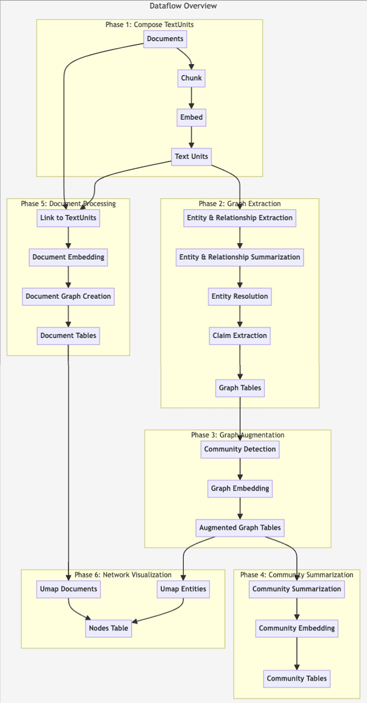

# 微软GraphRAG源码理解

## 1.引言

2024年四月份，微软发布一篇文章《From Local to Global: A Graph RAG Approach to Query-Focused Summarization》，提出了graphRAG的方法，该方法很好地解决了典型RAG系统在聚焦于查询的总结性 (QFS) 任务上存在的问题，并且在生成答案的全面性和多样性方面，Graph RAG 比朴素的 RAG 基线有了显着的改进。

2024年六月份，微软开源了graphRAG的项目 https://github.com/microsoft/graphrag 

为RAG带来新的发展，因此本人想从论文的原理以及源码部分去剖析和解读，希望进一步理解其核心结构，以求能做出一些速度上的优化

## 2.探究GraphRAG原理

- 为什么要在传统的RAG上发展GraphRAG？什么是GraphRAG？

传统RAG在针对整个文本语料库的全局问题上回答不佳，比如：这个数据集的主要主题是什么？这种问题不是简单的检索任务，是聚焦于查询的总结性任务。

GraphRAG核心思想：首先从源文档中派生一个实体知识图谱（通过大模型提取实体、关系，社区检测提取社区），然后为所有密切相关的实体组预先生成社区摘要。给定一个问题，每个社区摘要都用于生成部分响应，然后再次将所有部分响应汇总到对用户的最终响应中


- graphRAG原理

  

graphRAG中的一些名词：

**文档（Documents)**：输入的文档，源码中要求是txt格式。

**文本单元（Text Unit)**:要分析的文本块。这些块的大小、它们的重叠以及它们是否遵循任何数据边界可以自行配置。一个常见的用例是将`CHUNK_BY_COLUMNS`设置为`id` ，以便文档和 TextUnit 之间存在一对多关系，而不是多对多关系

**实体（Entity）**：从 TextUnit 中提取的实体。它们代表人物、地点、事件或您提供的其他一些实体模型

**关系（Relationship）**：两个实体之间的关系。这些是从协变量生成的。

**协变量(Covariate)** ：提取的声明信息，其中包含有关实体的陈述，这些陈述可能是时间相关的。

**社区报告（Community Report）**：生成实体后，我们会对它们执行分层社区检测，并为该层次结构中的每个社区生成报告

**节点（Node）**：此表包含已嵌入和集群的实体和文档的渲染图形视图的布局信息



- **流程**

（1）   将文本切割为文本块

（2）   LLM识别文本中的实体。大模型首先识别文本中的所有实体，包括它们的名称、类型和描述，然后再识别明确相关的实体之间的所有关系，包括源实体和目标实体及其关系的描述；进行了多轮实体收集

（3）   为实体创建摘要 LLM来独立地创建可能隐含但未由文本本身陈述的概念的有意义的摘要，

（4）   实体摘要->同质无向加权图 社区检测算法来将图划分为彼此之间的连接比与图中的其他节点之间的连接更强的节点社区

（5）   生成社区摘要 

（6）  社区摘要 → 社区答案 → 全局答案；

- 准备社区摘要，社区摘要被随机打乱并分成预先指定的token大小的块。这确保了相关信息分布在各个块中，而不是集中（并可能丢失）在单个上下文窗口中；
- 映射社区答案。并行生成中间答案，每个块一个。这LLM还要求生成 0-100 之间的分数，表明生成的答案对于回答目标问题有多大帮助。得分为 0 的答案将被过滤掉。
- 减少到全局答案。中间社区答案按有用性分数的降序排序，并迭代添加到新的上下文窗口中，直到达到令牌限制。最终上下文用于生成返回给用户的全局答案。

最终提供两种搜索的方法：本地搜索和全局搜索

**本地搜索：**本地搜索方法通过将人工智能提取的知识图谱中的相关数据与原始文档的文本块相结合来生成答案。此方法适用于需要了解文档中提到的特定实体的问题（例如洋甘菊的治疗特性是什么？）

**全局搜索：**全局搜索方法通过以地图缩减方式搜索所有人工智能生成的社区报告来生成答案。这是一种资源密集型方法，但通常可以很好地回答需要理解整个数据集的问题（例如，本笔记本中提到的草药最重要的价值是什么？）

## 3.源码结构

源码的结构如下

```
├─config
│  ├─input_models
│  └─models
├─index
│  ├─cache
│  ├─config
│  ├─emit
│  ├─graph
│  │  ├─embedding
│  │  ├─extractors
│  │  │  ├─claims
│  │  │  ├─community_reports
│  │  │  ├─graph
│  │  │  └─summarize
│  │  ├─utils
│  │  └─visualization
│  ├─input
│  ├─llm
│  ├─progress
│  ├─reporting
│  ├─storage
│  ├─text_splitting
│  ├─utils
│  ├─verbs
│  │  ├─covariates
│  │  │  └─extract_covariates
│  │  │      └─strategies
│  │  │          └─graph_intelligence
│  │  ├─entities
│  │  │  ├─extraction
│  │  │  │  └─strategies
│  │  │  │      └─graph_intelligence
│  │  │  └─summarize
│  │  │      └─strategies
│  │  │          └─graph_intelligence
│  │  ├─graph
│  │  │  ├─clustering
│  │  │  │  └─strategies
│  │  │  ├─embed
│  │  │  │  └─strategies
│  │  │  ├─layout
│  │  │  │  └─methods
│  │  │  ├─merge
│  │  │  └─report
│  │  │      └─strategies
│  │  │          └─graph_intelligence
│  │  ├─overrides
│  │  └─text
│  │      ├─chunk
│  │      │  └─strategies
│  │      ├─embed
│  │      │  └─strategies
│  │      ├─replace
│  │      └─translate
│  │          └─strategies
│  └─workflows
│      └─v1
├─llm
│  ├─base
│  ├─limiting
│  ├─mock
│  ├─openai
│  └─types
├─model
├─prompt_tune
│  ├─generator
│  ├─loader
│  ├─prompt
│  └─template
├─query
│  ├─context_builder
│  ├─input
│  │  ├─loaders
│  │  └─retrieval
│  ├─llm
│  │  └─oai
│  ├─question_gen
│  └─structured_search
│      ├─global_search
│      └─local_search
└─vector_stores

```

