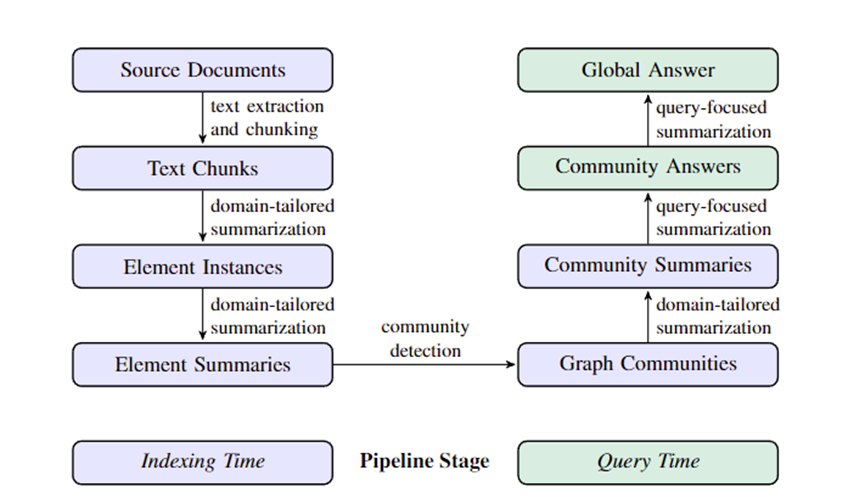

# 微软GraphRAG源码理解

## 1.引言

2024年四月份，微软发布一篇文章《From Local to Global: A Graph RAG Approach to Query-Focused Summarization》，提出了graphRAG的方法，该方法很好地解决了典型RAG系统在以查询为中心的摘要 (QFS) 任务上存在的问题，并且在生成答案的全面性和多样性方面，Graph RAG 比朴素的 RAG 基线有了显着的改进。

2024年六月份，微软开源了graphRAG的项目（https://github.com/microsoft/graphrag）

为RAG带来新的发展，因此本人想从论文的原理以及源码部分去剖析和解读，希望进一步理解其核心结构，以求能做出一些速度上的优化

## 2.探究GraphRAG原理

- 为什么要在传统的RAG上发展GraphRAG？什么是GraphRAG？

传统RAG在针对整个文本语料库的全局问题上回答不佳，比如：这个数据集的主要主题是什么？这种问题不是简单的检索任务，是以查询为中心的摘要任务。

GraphRAG核心思想：首先从源文档中派生一个实体知识图谱（通过大模型提取实体、关系，社区检测提取社区），然后为所有密切相关的实体组预先生成社区摘要。给定一个问题，每个社区摘要都用于生成部分响应，然后再次将所有部分响应汇总到对用户的最终响应中

- graphRAG流程

  

（1）   将文本切割为文本块

（2）   LLM识别文本中的实体。大模型首先识别文本中的所有实体，包括它们的名称、类型和描述，然后再识别明确相关的实体之间的所有关系，包括源实体和目标实体及其关系的描述；进行了多轮实体收集

（3）   为实体创建摘要 LLM来独立地创建可能隐含但未由文本本身陈述的概念的有意义的摘要，

（4）   实体摘要->同质无向加权图 社区检测算法来将图划分为彼此之间的连接比与图中的其他节点之间的连接更强的节点社区

（5）   生成社区摘要 

