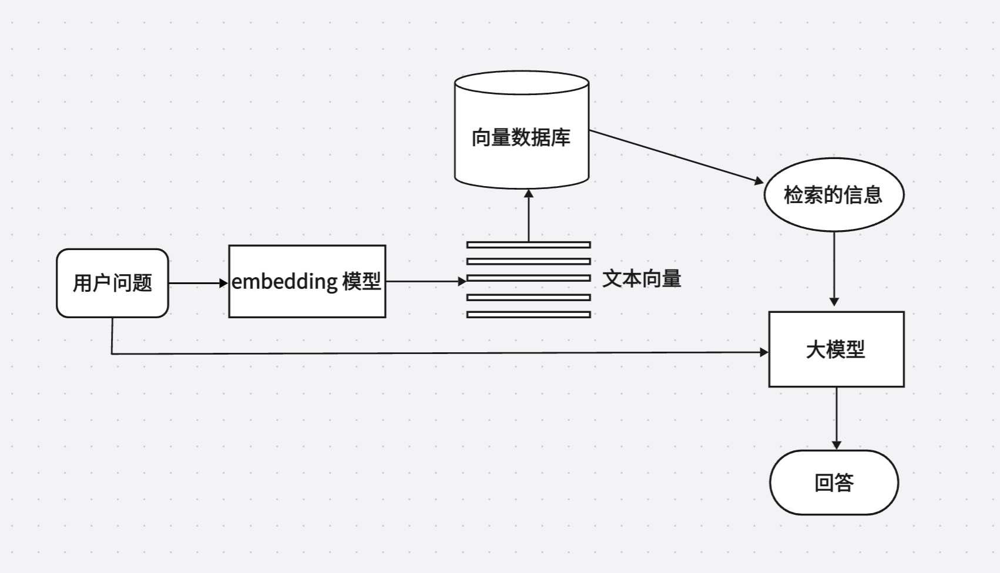
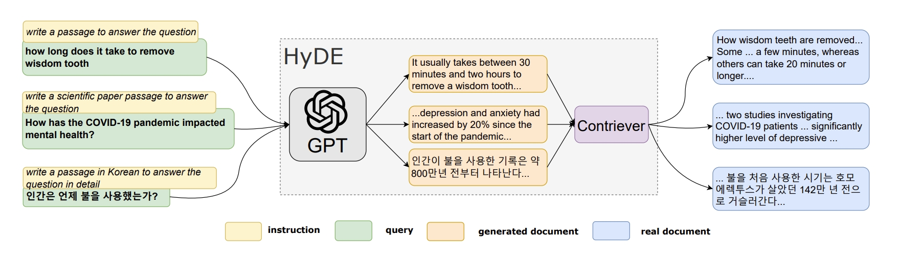
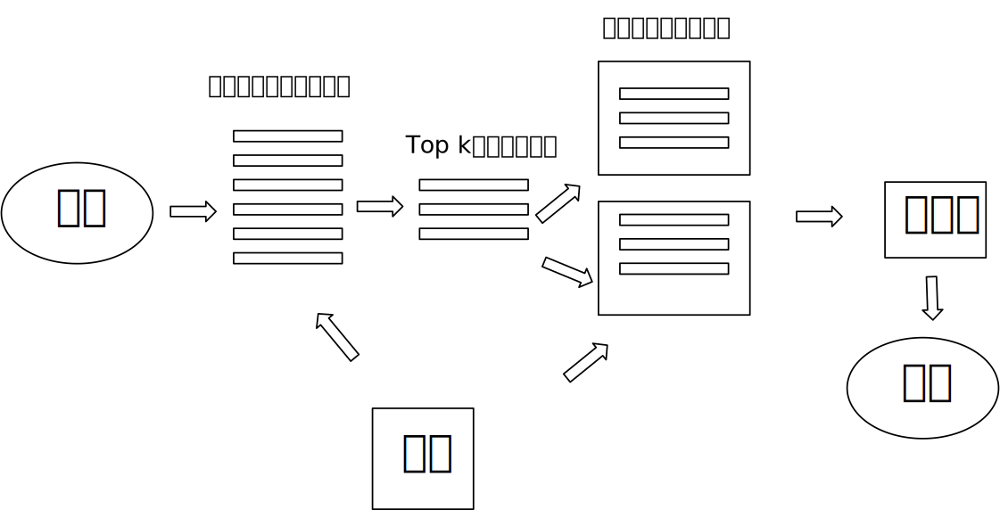
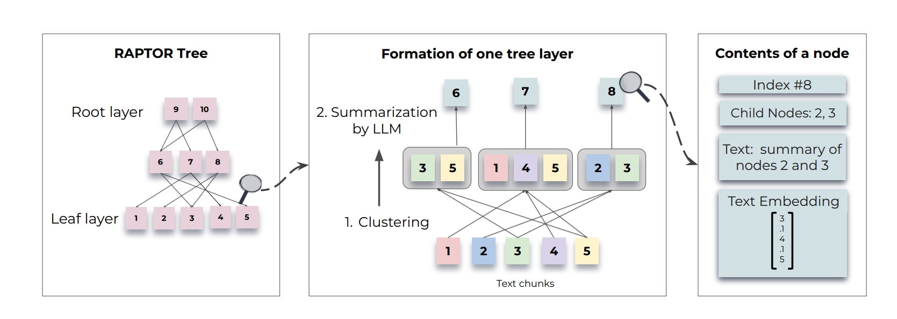
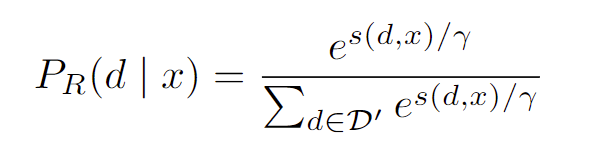
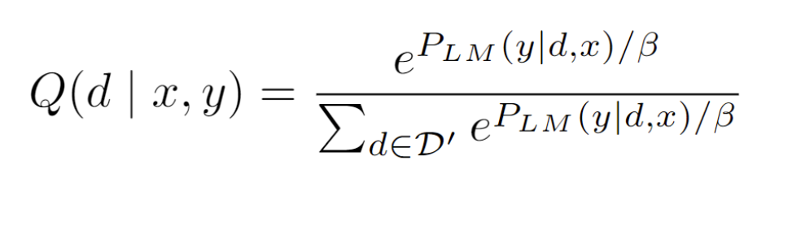

# 深入浅出RAG

RAG（Retrieval-Augmented Generation）检索增强生成是指从某些数据源检索到问题相关信息，提升大模型生成的效果的技术，其模式为**检索+LLM Prompt**，检索到的信息作为上下文注入到提示词prompt中。

RAG从2023年以来一直是非常流行的一套基于大模型的架构，其主要解决了三个方面的问题：（1）大模型在处理超出其能力范围的问题时会出现幻觉，给出一些格式正确但与真理相差很多的误导答案（2）在回答和私有数据相关或者垂直领域较深的问题时，大模型无法给出令人满意的答案。(3)由于训练成本高，参数量大的大模型存在知识时效性问题，没有办法更新最新的知识

用通俗的话来说，我们可以把用户给出的问题当作一场考试，每一个预训练好的大模型就是考场上的学生，RAG相当于考场上开卷考试提供的资料，优秀的RAG会针对考场的题目用最快的速度给出最相关的资料，然后让我们的大模型根据这些资料去回答。

## 1.普通RAG的流程与局限



普通的RAG的流程如下：

（1）构建文本向量数据库：对各种格式的文档PDF、HTML、Word 和 Markdown进行清理和提取，最终转换为纯文本文档，然后将文本切割为合适大小、段落尽量完整的块，然后使用嵌入模型转换为向量，存储在向量数据库中

（2）用相同的embedding模型将用户的问题转为向量（暂且称之为查询向量）

（3）在向量数据库中搜索和匹配与查询向量相似性高的，选取最高的前k个文本块，作为上下文，和用户的问题一起送入大模型，然后大模型作出回答

根据上面普通RAG流程，我们可以思考下面几个问题：

### （1）查询向量和向量数据库的向量的相似性搜索有多准？

讨论这个问题之前，先做一个实验，选取的是openai的text-embedding-3-small（目前较为先进的embedding模型），我们给出了一个查询问题，以及相关的一些语句（该实验的测试题目来自[4]）

```python
import os
os.environ["OPENAI_API_KEY"]= ""

import numpy as np
from openai import OpenAI
from sklearn.metrics.pairwise import cosine_similarity

client = OpenAI()

def get_embedding(s:str):
    if len(s)==0:
        return
    else:
        return client.embeddings.create(
            input=s, model="text-embedding-3-small" # nomic-embed-text text-embedding-3-small
            ).data[0].embedding

query = "I like apple"

# 相关语句
related_sentences = [
    "i don't like apple",
    "i don't like apples",
    "i dislike fruits",
    "i am a vagan",
    "apple makes me happy"
]

# 获取查询语句和相关语句的嵌入
query_embedding = get_embedding(query)
related_embeddings = [get_embedding(sentence) for sentence in related_sentences]

# 将嵌入转换为 NumPy 数组
query_embedding_np = np.array(query_embedding).reshape(1, -1)
related_embeddings_np = np.array(related_embeddings)

# 计算余弦相似度
similarities = cosine_similarity(query_embedding_np, related_embeddings_np)[0]

# 打印结果
for sentence, similarity in zip(related_sentences, similarities):
    print(f"句子: {sentence}\n相似度: {similarity}\n")
```

下面是输出

```python
句子: i don't like apple
相似度: 0.809324201675432

句子: i don't like apples
相似度: 0.7381684275506182

句子: i dislike fruits
相似度: 0.45008424256851837

句子: i am a vagan
相似度: 0.25186223466431923

句子: apple makes me happy
相似度: 0.7087407861105871
```

从这个例子可以看到，向量相似性最高选出的往往不一定是最佳选项，它对于词语情感上的差异排序优先级不高，且对名词的单数、复数比较敏感。

### （2）文本切割的块的大小和top-k怎么设置最佳？

目前主流的文本切割方法有直接按token数量进行暴力切割，有按照段落进行切割的，有递归切割的等等，但是无论哪一种切割文本的方法，都不可避免的会出现一个文本块中包含两个或多个不同的话题，试想一下，如果对于查询的问题而言，如果相关性很高的语句被其他不相关的语句淹没了，它能否在检索的过程中被找到呢？我们进行一个实验，下面是代码

```python
import os
os.environ["OPENAI_API_KEY"]= ""

import numpy as np
from openai import OpenAI
from sklearn.metrics.pairwise import cosine_similarity

client = OpenAI()

def get_embedding(s:str):
    if len(s)==0:
        return
    else:
        return client.embeddings.create(
            input=s, model="text-embedding-3-small" # nomic-embed-text text-embedding-3-small
            ).data[0].embedding

query = "i like apple."

# 相关语句
related_sentences = [
    """
The journey of human history is a tale of relentless exploration, from the earliest days when our ancestors roamed the African savannas, to the modern age where we traverse the skies and oceans, uncovering the secrets of our world and beyond. In this grand narrative, every era has been marked by significant discoveries and the courage to venture into the unknown. The curiosity that drove early humans to migrate across continents is the same force that today compels us to probe the depths of the oceans and the far reaches of outer space.

In ancient civilizations, the quest for knowledge was intertwined with survival. People studied the stars to predict the seasons, enabling them to cultivate crops and sustain their communities. The development of writing systems allowed for the preservation and dissemination of knowledge, ensuring that each generation could build upon the discoveries of the past. This accumulation of wisdom laid the groundwork for the great empires of antiquity, where science, philosophy, and art flourished in a symbiotic relationship.

As time passed, the Renaissance era brought a resurgence of learning and culture, fueled by the rediscovery of classical texts and the invention of the printing press. This period saw an explosion of creativity and inquiry, as scholars and artists alike sought to understand the world and express the human experience in new ways. The spirit of the Renaissance was embodied by figures such as Leonardo da Vinci and Galileo Galilei, whose contributions spanned multiple disciplines, pushing the boundaries of what was known and understood.

The Scientific Revolution that followed was a direct result of this renewed focus on observation and experimentation. Thinkers like Isaac Newton and Johannes Kepler sought to explain the natural world through the lens of mathematics and empirical evidence. Their work laid the foundation for modern science, where hypotheses are tested rigorously, and theories are constantly refined in light of new data. The technological advancements of the Industrial Revolution, which came next, further accelerated human progress, transforming societies and economies at an unprecedented pace.

Today, we live in a world shaped by the innovations of the past, yet still driven by the same insatiable curiosity. The digital age has ushered in an era of information, where knowledge is more accessible than ever before. The internet has become a global repository of human thought, a vast network where ideas are shared and debated across borders and cultures. This interconnectedness has fostered a new level of collaboration and innovation, as scientists, engineers, and thinkers from around the world work together to solve the pressing challenges of our time.

Climate change, for instance, represents one of the most significant threats to our planet's future. The scientific consensus is clear: human activity is altering the Earth's climate, with potentially devastating consequences. However, this challenge also presents an opportunity for innovation. Researchers are developing new technologies to reduce carbon emissions, harness renewable energy, and mitigate the impacts of climate change. The global community is beginning to recognize the importance of sustainability, with governments, corporations, and individuals taking steps to protect our planet for future generations.

In the realm of space exploration, humanity continues to push the boundaries of what is possible. The successful landing of rovers on Mars, the ongoing research aboard the International Space Station, and the ambitious plans for manned missions to other planets all speak to our enduring desire to explore the cosmos. These endeavors are not just about discovering new worlds; they also have the potential to unlock new technologies and resources that could benefit life on Earth.

Yet, even as we look to the stars, it is essential to remember the importance of understanding and preserving our own world. The study of ecology, for example, has revealed the intricate web of relationships that sustain life on our planet. Each species, no matter how small, plays a role in maintaining the balance of our ecosystems. The loss of biodiversity, driven by habitat destruction, pollution, and climate change, threatens to unravel this delicate balance, with far-reaching consequences for all life on Earth.

The advancement of artificial intelligence (AI) represents another frontier of human exploration. AI has the potential to revolutionize industries, from healthcare to finance, by automating tasks and providing insights that were previously unimaginable. However, it also raises ethical questions about the role of machines in society, the future of work, and the nature of consciousness itself. As we continue to develop and integrate AI into our lives, it is crucial to consider these implications and ensure that this technology is used for the betterment of humanity.

At the same time, the study of human psychology and neuroscience is shedding new light on the mysteries of the mind. Understanding how the brain works, how we think, feel, and make decisions, has profound implications for fields such as education, mental health, and personal development. By exploring the inner workings of our minds, we can better understand ourselves and improve our lives in meaningful ways.

In reflecting on these themes, it is evident that the quest for knowledge and discovery is deeply embedded in the human spirit. Throughout history, we have sought to understand the world around us, to improve our circumstances, and to explore the unknown. Whether through the study of ancient texts, the observation of the stars, or the development of cutting-edge technology, our pursuit of knowledge has been a constant driving force.

As we look to the future, it is clear that this pursuit will continue to shape our world in profound ways. From addressing global challenges such as climate change and biodiversity loss to exploring new frontiers in space and technology, the path forward will require collaboration, innovation, and a deep commitment to the betterment of humanity. In moments of reflection, I often find myself considering the simple pleasures of life, like how I enjoy eating apple during a quiet afternoon. Such moments remind us of the importance of balance, of finding joy in the everyday while continuing to reach for the stars.

In conclusion, the journey of human history is a testament to our relentless curiosity and desire for progress. As we continue to explore the mysteries of the universe and our own minds, we must do so with a sense of responsibility and a commitment to ensuring that the knowledge we gain is used to create a better world for all.
""",
    "i dont like apple",
]

# 获取查询语句和相关语句的嵌入
query_embedding = get_embedding(query)
related_embeddings = [get_embedding(sentence) for sentence in related_sentences]

# 将嵌入转换为 NumPy 数组
query_embedding_np = np.array(query_embedding).reshape(1, -1)
related_embeddings_np = np.array(related_embeddings)

# 计算余弦相似度
similarities = cosine_similarity(query_embedding_np, related_embeddings_np)[0]

# 打印结果
idx=0
# 打印结果
for sentence, similarity in zip(related_sentences, similarities):
    print(f"句子{idx}: \n相似度: {similarity}\n")
    idx+=1
```

下面是输出结果

```
句子0: 
相似度: 0.14242785109432549

句子1: 
相似度: 0.7438104997372591
```

其中句子0中是包含一句“I enjoy eating apple during a quiet afternoon.”但是完全被一些无关信息给淹没了，导致其与查询语句的向量相似度很低，因此可见，当文本切割块的size过大，会导致命中率降低

还有topk这一参数设置，因为我们知道大模型的上下文token是有限制的，且如果上下文很长，模型消耗的算力也比较大，推理时间也会较长，在上一个问题中我们不能保证相似性最高的就是最想要的结果，topk参数设置和文本块切割设置多少，能保证RAG系统发挥最佳性能呢？超参数的调整和验证方案可能能发挥作用，但是当文档数量越多，其调整的成本也就越大。

### （3）多跳问答（Multi-hop Q&A ）应该如何解决？

多跳问答（Multi-hop Q&A）是一种自然语言处理（NLP）技术，涉及到在回答复杂问题时，需要通过多步推理，从多个不同的信息源或文本片段中逐步获取和整合相关信息，最终得出正确答案的过程。与传统的单步问答系统不同，多跳问答要求系统能够在理解和连接多个相关的信息点之间进行推理，以完成跨越多个逻辑或语义层次的推理任务。这个过程通常涉及多个推理步骤或“跳跃”，以便在分散的上下文中找到最终答案。

比如我询问这样一个问题

```
谁是《哈利·波特》的作者的导师？
```

**解答过程**:

1. **第一步**：从问题中提取信息，“《哈利·波特》的作者是谁？”
   - **答案**: 《哈利·波特》的作者是J.K.罗琳（J.K. Rowling）。
2. **第二步**：接着提取信息，“J.K.罗琳的导师是谁？”
   - **答案**: J.K.罗琳的导师是伊恩·班克斯（Ian Rankin）（假设在某个具体场景中是她的导师）。

**最终答案**: J.K.罗琳的导师是伊恩·班克斯。

在这个例子中，需要通过多个推理步骤，先找出《哈利·波特》的作者是谁，然后再找到该作者的导师是谁。这种多步推理的过程就是“多跳问答”的核心特征。然而普通一步式的RAG很难回答这种多跳问答，需要进行改进。

### （4）总结性问题如何解决？

总结性问题比如：“这篇文章主要讲了什么内容？”，“这篇文章的top5主题是什么？"，普通的RAG或者传统RAG都无法解决这类问题，需要使用graphRAG，关于graphRAG的相关内容可以看我另一篇笔记。

## 2.RAG改进方法


### (1)输入增强

#### 查询转换：

查询转换可以通过修改输入查询来增强检索结果。Query2doc 和 HyDE使用原始查询生成伪文档，随后将其用作检索查询。伪文档包含更丰富的相关信息，有助于检索出更准确的结果。 TOC  利用检索到的内容将模糊查询分解为多个清晰的子查询，这些子查询被发送到生成器并聚合以生成最终结果

举一个HyDE的例子：

```
用户提了一个问题：how long does it take to remove wisdom tooth
第一步：先让大模型根据这个问题生成回答，下面是提示词：
write a passage to answer the question：how long does it take to remove wisdom tooth
第二步：结合回答和用户问题，一起送到检索器中进行检索
```

下面是HyDE论文中的原理示意图



#### 数据增强：

数据增强在检索之前改进数据，包括删除不相关信息、消除歧义、更新过时文档、合成新数据等技术


### （2）检索器增强

#### 递归检索：

通过多次搜索来检索更丰富、更高质量的内容。 ReACT 使用思维链将查询分解为递归检索并提供更丰富的信息

ReACT模式给大模型提供了一些工具接口供调用，举一个ReACT的例子，其中Action中可以调用工具的接口，其中ReACT可以迭代调用大模型，直到Action采取的FINISH，或者设定的达到最大的调用次数

```
用户提了一个问题：
	太阳马戏团 Mystere 演出所在地酒店有多少间客房？
第一步思考：
	我需要搜索 Cirque du Soleil 的 Mystere 表演，找到它所在的酒店，然后找到酒店的房间数
Action：
	Search[Cirque du Soleil 的 Mystere 表演]
工具调用结果1：
	找不到 Cirque du Soleil 的 Mystere 表演
第二步思考：
	要找到酒店，我可以搜索 Mystere (Cirquedu soleil)
Action：
	Search[Mystere(cirque du Soleil)]
工具调用结果2：
	在金银岛酒店和赌场的定制剧院举行
第三步思考：
	Mystere 在金银岛酒店和赌场的定制剧院举行，因此我接下来需要搜索金银岛酒店和赌场，并找到酒店的房间数。
Action：
	搜索[金银岛酒店和赌场]
工具调用接口3：
	金银岛酒店和赌场。有 2,884 间客房和 220 间套房。
第四步思考：
	金银岛酒店和赌场有 2,884 间客房和 220 间套房。所以答案是 3,104
Action：FINISH

```


#### 切块优化：

块优化是指调整块大小以改善检索结果。 LlamaIndex结合了一系列块优化方法，其中一种方法遵循“从小到大”的原则。这里的核心概念是精确定位更细粒度的内容但返回更丰富的信息。

**句子窗口检索法**：对每个句子都进行编码，检索到的最相关单句之前后各扩展 *k* 个句子，然后把这个扩展后的上下文送给 LLM 进行推理

**自动合并检索法**：

自动合并检索法和句子窗口检索法的思路一直，它把文本分成大的父文本块和更小、更精细的子块，子块去和问题做向量检索，然后通过子块找到对应的父块，最终将父块送到大模型



**RAPTOR**将文本变成多级树结构：



为了解决缺乏上下文信息的问题，RAPTOR 采用递归嵌入、聚类和文本块汇总，直到进一步聚类变得不可行，从而构建一个多级树结构。


#### 检索器微调：

检索器依赖embedding模型来聚类相关内容，而embedding模型可以使用特定领域或与任务相关的数据进行微调，以提高目标领域的性能。

REPLUG将 LM 视为黑匣子，并根据最终结果更新检索器模型。APICoder 使用 python 文件和 api 名称、签名、描述对检索器进行微调。EDITSUM对检索器进行微调，以减少检索后摘要之间的 jaccard 距离。SYNCHROMESH在损失中添加了树距离 os AST，并使用目标相似性调整来微调检索器。 R-ConvED 使用与生成器相同的数据对检索器进行微调。 Kulkarni 等人 应用 infoNCE 损失来微调 Retriever

举REPLUG的例子看一下是如何对检索器的embedding进行微调的：

（1）检索文档并计算检索可能性
从给定输入上下文 x 的语料库 D 中检索具有最高相似度得分的 k 个文档 D⊂ D，然后我们计算每个检索到的文档 d 的检索可能性：



（2）计算LM似然度

使用 LM 作为评分函数来衡量每个文档可以在多大程度上改善 LM 困惑度。具体来说，首先计算 P(y | d, x)，即给定输入上下文 x 和文档 d 的情况下真实输出 y 的 LM 概率。概率越高，文档在改善 LM 困惑度方面就越好



（3）更新通过最小化检索可能性和 LM 分数分布之间的 KL 散度来调整检索模型参数
（4）数据存储索引的异步更新

#### 混合检索：

混合检索表示同时使用多种检索方法或从多个不同来源提取信息。 RAP-Gen 和 ReACC同时使用密集检索器和稀疏检索器来提高检索质量。Rencos使用稀疏检索器在句法级别检索类似的代码片段，使用密集检索器在语义级别检索类似的代码片段。

混合检索可以**结合传统的基于关键词的搜索和现代的语义或向量搜索**，其关键在于如何合理地融合这两种不同相似度得分的检索结果。通常使用互惠排名融合（Reciprocal Rank Fusion）算法来解决这一问题，该算法能够有效地对检索结果进行重新排序，从而获得最终的输出结果


#### 重排序：

使用重排序模型对检索到的内容进行重新排序。Re2G 在传统检索器之后应用了一个重排序器模型，以减少将文本压缩为向量所造成的信息丢失的影响。AceCoder 利用重排序模型对检索到的结果进行重新排序，以减少冗余项并获得多样化的检索结果


#### 检索转换：

检索转换涉及重新措辞检索到的内容以更好地激活生成器的潜力，从而提高输出。 FILCO 有效地从检索到的文本中清除无关材料，仅隔离相关的支持内容，以简化生成器的任务并促进准确的答案预测。FiD-Light最初使用编码器将检索到的内容转换为向量，然后对其进行压缩，从而大大减少了延迟时间。RRR通过模板将当前查询与每轮中的前 k 个文档集成，然后通过预先训练的 LLM（GPT-3.5-Turbo 等）对其进行重构。

### （3）生成器增强

#### 提示词工程：

提示词工程致力于提高 LLM 输出的质量，例如提示压缩、Stepback Prompt 、Active Prompt、Chain of Thought Prompt 等，均可应用于 RAG 系统中的 LLM 生成器

#### 解码调整：

解码调整包括通过微调超参数来增强生成器控制以增加多样性和限制输出词汇量等调整。 InferFix通过调整解码器中的温度来平衡结果的多样性和质量。SYNCHROMESH通过实现完成引擎来限制解码器的输出词汇量，以消除实现错误

#### 生成器微调：

生成器的微调可以增强模型拥有更精确的领域知识或更好地与检索器匹配的能力。 RETRO固定了检索器的参数，并在生成器中使用分块交叉注意机制将查询和检索器的内容结合起来

### （4）结果增强

#### 输出重写：

输出重写是指在某些场景下重写生成器生成的内容以满足下游任务的需求。SARGAM [165] 通过使用特殊的 Transformer 以及删除、占位符和插入分类器来细化代码相关任务中的输出，以更好地与现实世界的代码上下文保持一致。

### （5）流程增强

#### 自适应检索：

一些关于 RAG 的研究表明，检索并不总能增强最终结果。当模型固有的参数化知识足以回答相关问题时，过度检索可能会导致资源浪费和潜在的混淆。目前有两种确定检索必要性的方法：基于规则和基于模型的方法。

基于规则：FLARE主动决定是否以及何时在生成过程中搜索概率。Efficient-KNNLM将 KNN-LM和 NPM的生成概率与超参数 λ 相结合，以确定生成和检索的比例。 Mallen 等人对问题进行统计分析，以便对高频问题进行直接回答，对低频问题应用 RAG

基于模型：Self-RAG 使用训练好的生成器，根据不同用户查询下的检索 token 判断是否进行检索。Ren 等使用“判断提示”来判断 LLM 是否能回答相关问题以及答案是否正确，从而辅助判断检索的必要性。 SKR利用 LLM 自身提前判断能否回答问题的能力，如果能回答，则不进行检索。

#### 迭代检索：

迭代 RAG 通过反复循环检索和生成阶段（而不是单次循环）来逐步细化结果。 RepoCoder使用迭代检索-生成方法完成代码，使用先前生成的代码细化查询，以更好地利用分散的信息并改善结果。ITER-RETGEN通过使用生成器的输出来查明知识差距、检索必要信息并为未来的生成周期提供信息，迭代地提高内容质量。

## 3.RAG开源项目介绍：

### （1）支持RAG的框架

目前主流的RAG框架有llamaIndex和LangChain；两个框架的官方文档中对如何搭建RAG都有详细的介绍，这些框架对于RAG的很多流程都做好了封装，调用起来比较简便

### （2）RAG开源项目

目前github上有两个比较好的RAG开源项目，分别是有道的QAnything https://github.com/netease-youdao/QAnything

和ragFlow https://github.com/infiniflow/ragflow

## 4.一些思考

### (1)RAG和微调应该怎么选择？

|          | RAG                                                          | 微调                                                         |
| -------- | ------------------------------------------------------------ | ------------------------------------------------------------ |
| 知识更新 | 通过更新数据库，无需重新训练                                 | 需要用新数据重新训练以更新知识                               |
| 效果     | 稳定性和可解释性方面表现较好，因为是根据检索到的真实数据回答 | 对于简单的任务，微调可能达到更高的效果上限，因为它可以针对性地调整模型参数 |
| 成本     | 推理时，需要额外的时间检索                                   | 微调时需要GPU算力                                            |
| 劣势     | 检索系统的质量决定最终的效果；<br />需要检索的时间，对实时性有一定影响 | 需要资源进行训练；<br />容易遗忘未在训练数据中出现的知识     |
| 适用场景 | 知识需要快速更新的领域<br />对实时性要求不是特别高的应用场景。<br />需要高度可解释性或准确性的场景 | 数据量较小但质量高的领域。<br /> 对模型效果有较高要求，且可以承担相应计算资源消耗的场景。<br /> 领域知识比较独特，需要模型深入学习的场景。 |

RAG 系统通过检索外部数据源的相关信息并结合生成模型来生成响应，适用于需要频繁访问外部知识库或动态数据源的应用场景。RAG 系统可以很容易地对事实进行检查，能减少模型幻觉，并在数据频繁变化时保证模型输出的时效性。其可解释性较强，能够追溯生成结果背后的数据来源。

微调技术则侧重于对模型行为的调整，适用于需要特定写作风格或行业术语的场景，能根据领域数据深度定制模型的响应。但微调过程依赖大量标记数据，数据变化时需要频繁更新模型，并且在处理外部知识时表现不佳。

总结起来，如果应用需要频繁查询外部知识库、减少幻觉并提升结果透明度，RAG 是更好的选择；而如果应用需要调整模型行为和风格，则微调技术更具优势。在一些复杂场景下，结合两种技术的混合方法可能会获得最佳效果。

## 5.参考文献

[1]Zhao, Penghao, et al. "Retrieval-augmented generation for ai-generated content: A survey." *arXiv preprint arXiv:2402.19473* (2024).

[2]Gao, Yunfan, et al. "Retrieval-augmented generation for large language models: A survey." *arXiv preprint arXiv:2312.10997* (2023).

[3]https://pub.towardsai.net/advanced-rag-techniques-an-illustrated-overview-04d193d8fec6

[4]https://medium.com/@kelvin.lu.au/disadvantages-of-rag-5024692f2c53

[5]https://luxiangdong.com/2023/09/25/ragone/

[6]P. S. H. Lewis, E. Perez, A. Piktus et al., “Retrieval-augmented generation for knowledge-intensive NLP tasks,” in NeurIPS, 2020.

[7]O. Ram, Y. Levine, I. Dalmedigos et al., “In-context retrievalaugmented language models,” arXiv:2302.00083, 2023.

[8]G. Izacard and E. Grave, “Leveraging passage retrieval with generative models for open domain question answering,” in EACL, 2021.

[9]Shi, Weijia, et al. "Replug: Retrieval-augmented black-box language models." *arXiv preprint arXiv:2301.12652* (2023).

[10]https://www.53ai.com/news/qianyanjishu/138.html

[11]https://tczjw7bsp1.feishu.cn/wiki/Cs9ywwzJSiFrg9kX2r1ch4Nxnth